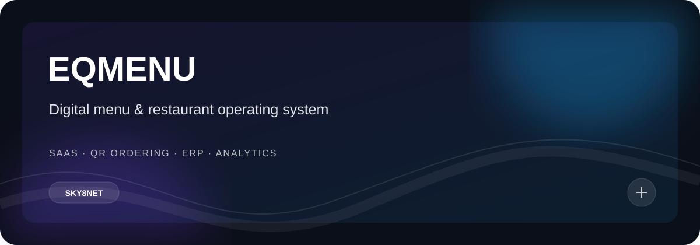
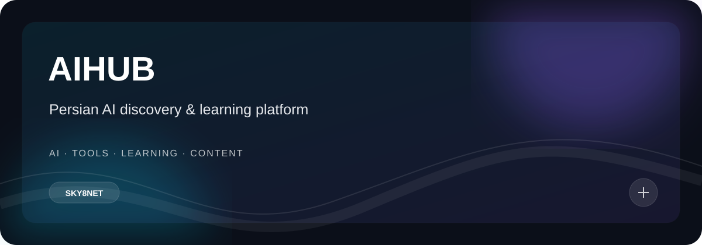
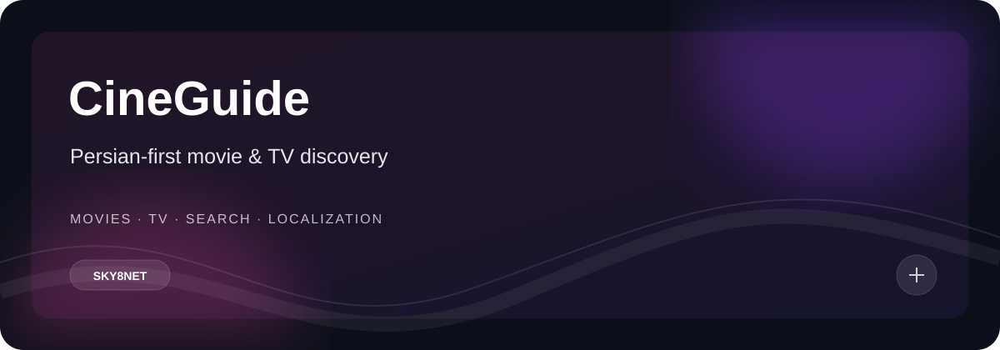
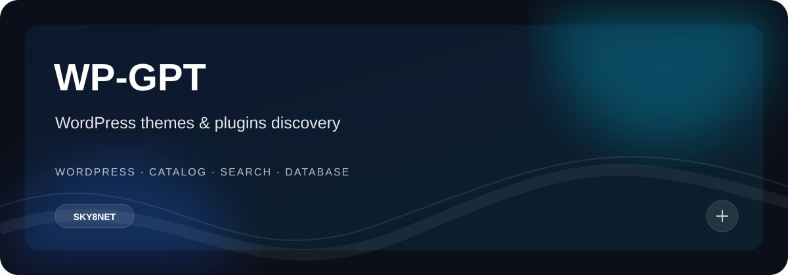
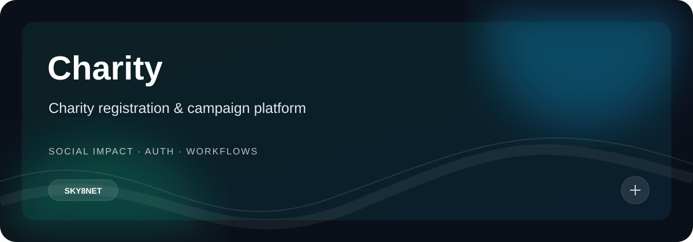
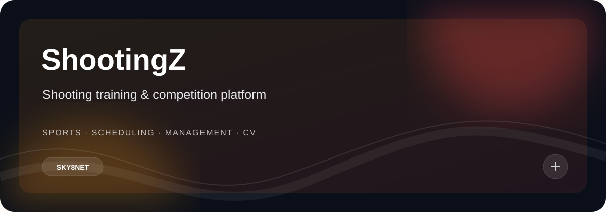
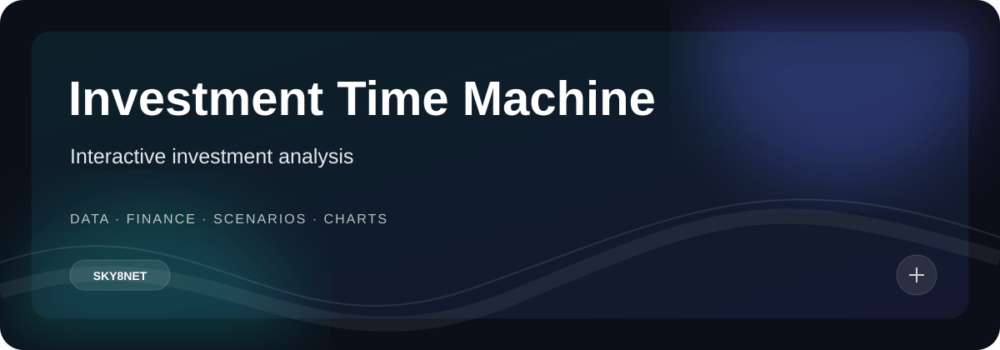
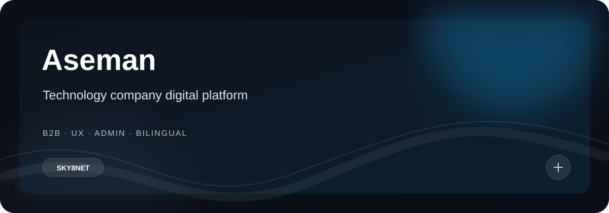
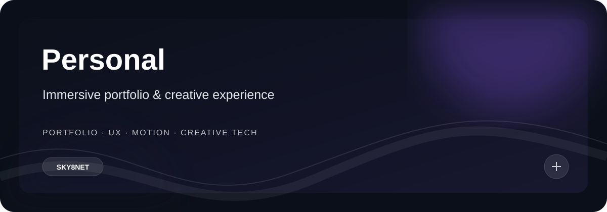

<div align="center">

# SKY8NET

### AI · SOFTWARE · PRODUCT · CREATIVE TECHNOLOGY

**I build digital products from idea to production.**

AI-powered applications, SaaS platforms, automation systems and immersive web experiences.

[](https://github.com/sky8net)
[](https://nextjs.org/)
[](https://www.typescriptlang.org/)
[](https://www.python.org/)
[](https://vercel.com/)

</div>

---

## The builder behind the projects

I work at the intersection of **AI, full-stack engineering, product design and automation**.

I enjoy taking an idea that starts as a rough concept and turning it into a system with a clear product, polished interface, real backend, reliable data, authentication, deployment and continuous improvement.

> **My goal is not to collect technologies. My goal is to build useful products with them.**

---

# 🚀 Project Wall

## Flagship products

<table>
<tr>
<td width="50%" valign="top">

<a href="https://eqmenu.com">

</a>

### 🍽️ EQMENU
**Digital menu & restaurant operating system**

A multi-tenant SaaS platform for cafes, restaurants and food businesses, covering QR ordering, digital menus, inventory, recipes, smart pricing, accounting, employees, reservations, customer management and reporting.

**Stack:** Next.js · TypeScript · Cloudflare

**Status:** 🟢 Active

<a href="https://eqmenu.com">🌐 Live product</a>

</td>
<td width="50%" valign="top">



### 🤖 AIHUB
**Persian AI discovery & learning platform**

A Persian-first ecosystem for discovering AI tools, learning through practical exercises, following AI news and using real prompts and workflows.

**Focus:** AI directory · learning · prompts · news · discovery

**Status:** 🟢 Active

</td>
</tr>
<tr>
<td width="50%" valign="top">



### 🎬 CineGuide
**Persian-first movie & TV discovery**

A modern movie and series guide with localized browsing, search and detailed title experiences designed for Persian users.

**Focus:** Movies · TV · Search · Localization

**Status:** 🟢 Active

</td>
<td width="50%" valign="top">



### 🧩 WP-GPT
**WordPress themes & plugins discovery**

A platform for discovering and downloading WordPress themes and plugins with structured catalog data, search, categories and persistent storage.

**Stack:** Next.js · TypeScript · Neon/PostgreSQL

**Status:** 🟢 Active

</td>
</tr>
</table>

---

## Real-world systems

<table>
<tr>
<td width="50%" valign="top">



### ❤️ Charity
**Digital infrastructure for charities**

Registration, roles, administration, campaign management, applications and public database-backed experiences in one professional platform.

**Focus:** Auth · RBAC · Review workflows · Campaigns · Applications

**Status:** 🟢 Active

</td>
<td width="50%" valign="top">



### 🎯 ShootingZ
**Shooting training & competition platform**

Digital infrastructure for shooting organizations covering training, registration, scheduling, competitions, dashboards and operational workflows.

**Next direction:** Computer-vision-assisted score detection for 10 m air rifle and air pistol targets.

**Status:** 🟢 Active

</td>
</tr>
<tr>
<td width="50%" valign="top">



### 📈 Investment Time Machine
**Interactive investment analysis**

A data-driven experience for exploring investment scenarios, visualizing outcomes and making financial assumptions easier to understand.

**Stack:** Next.js · TypeScript · Recharts

**Status:** 🟢 Active

</td>
<td width="50%" valign="top">

<a href="https://aseman-ni.ir/">

</a>

### 🏢 Aseman
**Technology company digital platform**

A professional bilingual platform for an IT/technology company combining public presentation with authenticated business administration.

**Focus:** B2B · UX · Admin · Bilingual

**Status:** 🟢 Active

<a href="https://aseman-ni.ir/">🌐 Live website</a>

</td>
</tr>
<tr>
<td width="50%" valign="top">



### ✦ Personal
**Immersive portfolio & creative experience**

A portfolio experiment focused on strong visual storytelling, evidence of work, content density and a more immersive personal web experience.

**Focus:** Portfolio · UX · Motion · Creative Tech

**Status:** 🟢 Active

</td>
<td width="50%" valign="top">

<div align="center">

### + More experiments

I continuously prototype ideas across AI, automation, data, web platforms, computer vision and creative technology.

**Private repositories · active experiments · product concepts**

</div>

</td>
</tr>
</table>

---

## ⚡ Recent momentum

The portfolio is built from active repositories, not archived demos.

| Date | Project | Direction |
|---|---|---|
| **06 Oct 2026** | CineGuide | Persian localization across detail and search |
| **05 Oct 2026** | Personal | Richer visual evidence and denser portfolio presentation |
| **05 Oct 2026** | WP-GPT | Persistent Neon/PostgreSQL foundation |
| **04 Oct 2026** | Investment Time Machine | Recharts + production/static-export compatibility |
| **03 Oct 2026** | AIHUB | Data integrity validation in production workflow |
| **03 Oct 2026** | Aseman | Authenticated admin and session hardening |
| **03 Oct 2026** | Charity | Auth, roles and production workflow stabilization |

---

## 🧠 How I build

```text
IDEA
  ↓
EXPLORE
  ↓
DESIGN
  ↓
BUILD
  ↓
TEST
  ↓
MEASURE
  ↓
IMPROVE
  ↓
SHIP
```

I care about the complete product:

**UX → architecture → data → security → performance → deployment → maintainability**

---

## 🤖 AI as a product capability

I use AI in two ways.

**As a tool:** research, prototyping, coding, debugging, experimentation and workflow acceleration.

**Inside products:** intelligent search, recommendations, assistants, automation, content systems, agents and computer-vision workflows.

> **I don't want AI sprinkled onto products. I want AI to make the product better.**

### Current AI interests

`LLMs` · `AI Agents` · `Tool Calling` · `Conversational AI` · `AI Automation` · `Computer Vision` · `Local AI`

---

## 🛠️ Technology

### Product engineering


### Data & infrastructure


### Product systems

`Authentication` · `RBAC` · `Admin Dashboards` · `Multi-Tenant SaaS` · `APIs` · `Business Workflows`

---

## 🎥 Creative technology

Software is only part of what I build.

**Videography · Filmmaking · Audio Recording · Video Editing · Post-Production · UI/UX · Visual Content**

My creative background influences how I approach software: hierarchy, rhythm, storytelling, motion, composition and the feeling of using a product all matter.

---

## 🧭 Direction

### AI + Software + Product Design + Automation + Creative Technology

I want to build products that are:

**useful · intelligent · well-designed · scalable · understandable**

Not just impressive in a demo.

---

<div align="center">

## CODE · AI · DESIGN · CREATIVITY

**Building ideas into products.**

<br />

[](https://github.com/sky8net)
[](https://github.com/sky8net)

<br /><br />

<sub>© 2026 Sky8net</sub>

</div>
